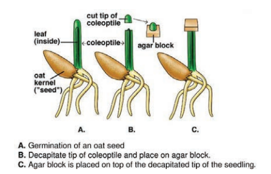
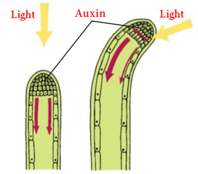
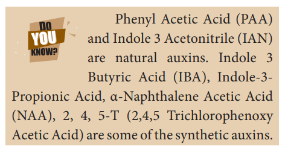
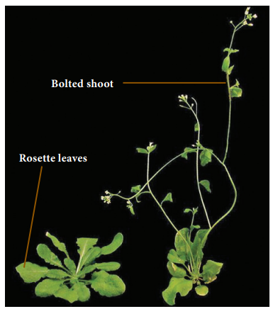
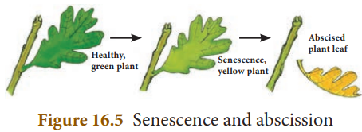
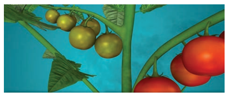
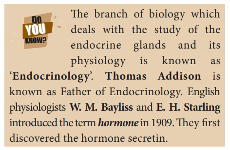
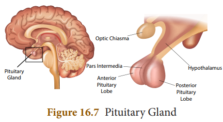

<!--   -->

**Learning Objectives**
<!--  -->
At the end of this lesson the students will be able to: ‹‹ Define hormone.

‹‹ List out plant hormones.

‹‹ Classify plant hormones into growth promoters and growth inhibitors.

‹‹ Differentiate the physiological effects of various plant hormones.

‹‹ Understand how plant hormones control and coordinate various physiological activities in plants.

‹‹ Know the various endocrine glands in the human body.

‹‹ Identify the location and structure of the endocrine glands in the human body.

‹‹ Differentiate exocrine and endocrine glands.

‹‹ Know the specific site of action and their functions.

‹‹ Identify the disorders which occur due to decreased or increased hormone secretion.

<!-- **Introduction** -->

&nbsp;&nbsp;&nbsp;&nbsp;&nbsp;&nbsp;The word hormone is derived from the Greek word “hormon” meaning “ to excite”. The function of control and coordination in plants is performed by chemical substances produced by the plants called **plant hormones**. In plants several cells are capable of producing hormones. These phytohormones are transported to different parts of the plants to perform various physiological functions.

**Endocrine glands** in vertebrate animals possess a diversified communication system to co-ordinate physiological and metabolic

functions by chemical integration. The endocrine system acts through chemical messengers known as hormones which are produced by specialized glands. Physiological processes such as digestion, metabolism, growth, development and reproduction are controlled by hormones.

<!-- ## Plant Hormones -->

&nbsp;&nbsp;&nbsp;&nbsp;&nbsp;&nbsp;**Plant hormones** are **organic molecules** that are produced at extremely low concentration in plants. These molecules control morphological, physiological and biochemical responses.

<!-- PLANT AND ANIMAL HORMONES16 -->

<!-- 10th\_Science Unit-16.indd 229 06-12-2021 18:42:15 -->

  

**Types of Plant Hormones** 
 There are five major

classes of plant hormones. They are:

1\. Auxins 2. Cytokinins 3. Gibberellins 4. Abscisic Acid (ABA) 5. Ethylene

Among all these plant hormones auxins, cytokinins and gibberellins promote plant growth while abscisic acid and ethylene inhibit plant growth.

**Figure 16.1** Hormonal interaction in plant growth and development

 

&nbsp;&nbsp;&nbsp;&nbsp;&nbsp;&nbsp;Auxins (Gk. auxein = to grow) were the first plant hormones discovered. The term auxin was introduced by Kogl and Haagen- Smith (1931). Auxins are **produced at the tip of stems and roots** from where they migrate to the zone of elongation. Charles Darwin (1880), observed unilateral growth and curvature of canary grass _(Phalaris canariensis)_ coleoptiles. He came to the conclusion that some ‘influence’ was transmitted from the tip of the coleoptile to the basal region. This ‘influence’ was later identified as Auxin by Went.

**16.1.1.1 Went’s Experiment** Frits Warmolt Went (1903– 1990), a

Dutch biologist demonstrated the existence

and effect of auxin in plants. He did a series of experiments in Avena coleoptiles.

&nbsp;&nbsp;&nbsp;&nbsp;&nbsp;&nbsp;In his first experiment he removed the tips of Avena coleoptiles. The cut tips did not grow indicating that the tips produced something essential for growth.In his second experiment he placed the agar blocks on the decapitated coleoptile tips. The coleoptile tips did not show any response. In his next experiment he placed the detached coleoptile tips on agar blocks. After an hour, he discarded the tips and placed this agar block on the decapitated coleoptile. It grew straight up indicating that some chemical had diffused from the cut coleoptile tips into the agar block which stimulated the growth.

&nbsp;&nbsp;&nbsp;&nbsp;&nbsp;&nbsp;From his experiments Went concluded that a chemical diffusing from the tip of coleoptiles was responsible for growth, and he named it as “**Auxin**” meaning ‘**to grow**”.

**Figure 16.2** Went’s Experiment

**Types of Auxins: Auxins are classified into** two types, namely natural auxins and synthetic auxins.

1\. **Natural Auxins:** Auxins produced by the plants are called natural auxins. Example: IAA (Indole – 3 - Acetic Acid)

2\. Synthetic Auxins: Artificially synthesized auxins that have properties like auxins are called as synthetic auxins. Example: 2, 4 D (2,4 Dichlorophenoxy Acetic Acid).

**Physiological effects of auxins: Auxins bring** about a variety of physiological effects in different parts of the plant body.

10th\_Science Unit-16.indd 230 06-12-2021 18:42:15

  

231 **Plant and Animal Hormones**

1\. Auxins promote the **elongation of stems** and **coleoptiles** which makes them to grow.

<!-- Auxin -->

**Figure 16.3** Cell Elongation

2\. Auxins **induce root formation** at low concentration and inhibit it at higher concentration.

3\. The auxins produced by the apical buds suppress growth of lateral buds. This is called **apical dominance**.

4\. Seedless fruits without fertilization are induced by the external application of auxins. (**Parthenocarpy**). Examples: Watermelon, Grapes, Lime etc.

5\. Auxins **prevent** the formation of **abscission layer**.

<!-- Phenyl Acetic Acid (PAA) and Indole 3 Acetonitrile (IAN) are natural auxins. Indole 3 Butyric Acid (IBA), Indole-3-

Propionic Acid, α-Naphthalene Acetic Acid (NAA), 2, 4, 5-T (2,4,5 Trichlorophenoxy Acetic Acid) are some of the synthetic auxins. -->

<!-- ### Cytokinins -->

Cytokinins (Cytos - cell; kinesis - division) are the plant hormones that **promote cell division or cytokinesis in plant cells. It was first** isolated from Herring fish sperm. Zeatin was the cytokinin isolated from _Zea mays_. Cytokinin is found abundantly in liquid endosperm of coconut.

**Physiological effects of cytokinins**

1\. Cytokinin induces **cell division** (cytokinesis) in the presence of auxins.

2\. Cytokinin also causes **cell enlargement**. 3. Both auxins and cytokinins are essential

for the formation of new organs from the callus in tissue culture (**Morphogenesis**).

4\. Cytokinins promote the growth of **lateral buds** even in the presence of apical bud.

5\. Application of cytokinin delays the process of ageing in plants. This is called Richmond **Lang effect.**

<!-- ### Gibberellins -->

&nbsp;&nbsp;&nbsp;&nbsp;&nbsp;&nbsp;Gibberellins are the most abundantly found plant hormones. Kurosawa (1926) observed **Bakanae disease** or **foolish seedling disease** in rice crops. This internodal elongation in rice was caused by fungus Gibberella fujikuroi. The active substance was identified as Gibberellic **acid**.

**Physiological effects of gibberellins**
 1\. Application of gibberellins on plants
stimulate extraordinary **elongation of internode**. e.g. Corn and Pea.

<!-- **Bolted shoot** -->

<!-- **Rosette leaves** -->

  &nbsp;&nbsp;&nbsp;&nbsp;&nbsp;&nbsp;&nbsp;&nbsp;&nbsp;&nbsp;&nbsp;&nbsp;  &nbsp;&nbsp;&nbsp;&nbsp;&nbsp;&nbsp; &nbsp;&nbsp;&nbsp;&nbsp;&nbsp;**Figure 16.4** Bolting 

2.Treatment of rosette plants with gibberellin
induces sudden shoot elongation followed by flowering. This is called  **bolting**.

<!-- 10th\_Science Unit-16.indd 231 06-12-2021 18:42:16 -->

<!-- 
|------|------| -->

  

3\. Gibberellins promote the **production of male flowers in monoecious plants** (Cucurbits).

4\. Gibberellins **break dormancy** of potato tubers.

5\. Gibberellins are efficient than auxins in inducing the formation of seedless fruit - **Parthenocarpic fruits** (Development of fruits without fertilization) e.g. Tomato.

<!-- ### Abscisic Acid -->

 &nbsp;&nbsp;&nbsp;&nbsp;&nbsp;&nbsp;&nbsp;&nbsp;&nbsp;&nbsp;&nbsp;&nbsp;Abscisic acid (ABA) is a **growth inhibitor** which **regulates abscission** and **dormancy**. It increases tolerance of plants to various kinds of stress. So, it is also called as **stress hormone**. It is found in the chloroplast of plants.

**Physiological effects of abscisic acid** 
1\. ABA promotes the process of **abscission**
(separation of leaves, flowers and fruits from the branch).

2\. During water stress and drought conditions ABA **causes stomatal closure**.

<!--  -->

<!-- **Healthy, green plant Senescence,**

**yellow plant**

**Abscised plant leaf**

**Figure 16.5** Senescence and abscission -->

3\. ABA **promotes senescence** in leaves by causing loss of chlorophyll.

4\. ABA **induces bud dormancy** towards the approach of winter in trees like birch.

5\. ABA is a powerful **inhibitor of lateral bud growth** in tomato.

<!-- ### Ethylene -->

&nbsp;&nbsp;&nbsp;&nbsp;&nbsp;&nbsp;&nbsp;&nbsp;&nbsp;&nbsp;&nbsp;&nbsp;Ethylene is a **gaseous plant hormone**. It is a **growth inhibitor**. It is mainly concerned with maturation and ripening of fruits. Maximum synthesis of ethylene occurs during ripening of fruits like apples, bananas and melons

**Physiological effects of ethylene**

1\. Ethylene promotes the **ripening of fruits**. e.g. Tomato, Apple, Mango, Banana, etc.

<!-- 
**Figure 16.6** Ethylene -->

2\. Ethylene **inhibits** the **elongation** of stem and root in dicots.

3\. Ethylene hastens the **senescence** of leaves and flowers.

4\. Ethylene stimulates **formation of** **abscission zone in leaves, flowers and** fruits. This leads to premature shedding.

5\. Ethylene **breaks the dormancy** of buds, seeds and storage organs.

<!-- ## Human Endocrine Glands -->

&nbsp;&nbsp;&nbsp;&nbsp;&nbsp;&nbsp;&nbsp;&nbsp;&nbsp;&nbsp;&nbsp;&nbsp;Endocrine glands in animals possess a versatile communication system to coordinate biological functions. Exocrine glands and endocrine glands are two kinds of glands found in animals. Endocrine glands are found in different regions of the body of animals as well as human beings. These glands are called **ductless**

<!-- **Activity**

Place two or three unripe tomatoes in a brown paper bag with a ripe bananas and roll the top closed. In another bag place two or three unripe tomatoes only and roll the top closed, Observe what happens to the tomatoes? Why?

As the banana continues to ripen in the first bag, it produces ethylene gas. The gas trapped in the bag will cause tomatoes to ripen.The tomatoes remain unripe in the second bag. -->

<!-- 10th\_Science Unit-16.indd 232 06-12-2021 18:42:16 -->

  

<!-- 233 **Plant and Animal Hormones** -->

**glands**. Their secretions are called **hormones** which are produced in **minute quantities**. The secretions diffuse into the blood stream and are carried to the distant parts of the body. They act on specific organs which are referred as **target organs**.

<!-- The branch of biology which deals with the study of the endocrine glands and its physiology is known as

‘**Endocrinology**’. **Thomas Addison** is known as Father of Endocrinology. English physiologists **W. M. Bayliss** and **E. H. Starling** introduced the term hormone in 1909. They first discovered the hormone secretin. -->

&nbsp;&nbsp;&nbsp;&nbsp;&nbsp;&nbsp;&nbsp;&nbsp;&nbsp;&nbsp;&nbsp;&nbsp;Exocrine glands have specific ducts to carry their secretions e.g. salivary glands, mammary glands, sweat glands.

Endocrine glands present in human and other vertebrates are

a. Pituitary gland
 b. Thyroid gland 
 c. Parathyroid gland
  d. Pancreas (Islets of Langerhans) 
  e. Adrenal gland (Adrenal cortex and
Adrenal medulla)
 f. Gonads(Testes and Ovary) g. Thymus gland

<!-- ### Pituitary Gland -->

&nbsp;&nbsp;&nbsp;&nbsp;&nbsp;&nbsp;&nbsp;&nbsp;&nbsp;&nbsp;&nbsp;&nbsp;The pituitary gland or hypophysis is a pea shaped compact mass of cells located at the base of the midbrain attached to the hypothalamus by a pituitary stalk. The 

gland is anatomically composed of two lobes and perform different functions. They are the anterior lobe (**adenohypophysis**) and the posterior lobe (**neurohypophysis**). The intermediate lobe is non-existent in humans.

&nbsp;&nbsp;&nbsp;&nbsp;&nbsp;&nbsp;&nbsp;&nbsp;&nbsp;&nbsp;&nbsp;&nbsp;The pituitary gland forms the major endocrine gland in most vertebrates. It regulates and controls other endocrine glands and so is called as the “**Master gland**”. **Hormones secreted by the anterior lobe (Adenohypophysis) of pituitary**

 &nbsp;&nbsp;&nbsp;&nbsp;&nbsp;&nbsp;&nbsp;&nbsp;&nbsp;&nbsp;&nbsp;&nbsp;The anterior pituitary is composed of different types of cells and secrete hormones which stimulates the production of hormones by other endocrine glands. The hormones secreted by anterior pituitary are

a. Growth Hormone
 b. Thyroid stimulating Hormone 
 c. Adrenocorticotropic Hormone
  d. Gonadotropic Hormone which
comprises the Follicle Stimulating Hormone and Luteinizing Hormone
e. Prolactin

**a. Growth hormone (GH)** 
 &nbsp;&nbsp;&nbsp;&nbsp;&nbsp;&nbsp;&nbsp;&nbsp;&nbsp;&nbsp;&nbsp;&nbsp;GH promotes the development and enlargement of all tissues of the body. It stimulates the growth of muscles, cartilage and long bones. It controls the cell metabolism.

The improper secretion of this hormone leads to the following conditions.

 **Dwarfism:** It is caused by decreased secretion of growth hormone in children. The characteristic features are stunted growth, delayed skeletal formation and mental disability.

**Gigantism:** Oversecretion of growth hormone leads to gigantism in children. It is characterised by overgrowth of all body tissues and organs. Individuals attain abnormal increase in height.

 **Acromegaly:** Excess secretion of growth hormone in adults may lead to abnormal enlargement of head, face, hands and feet.
<!--  
 **Figure 16.7** Pituitary Gland -->

<!-- Optic Chiasma

Pars Intermedia Hypothalamus

Anterior Pituitary

Lobe Posterior Pituitary

Lobe

Pituitary Gland

10th\_Science Unit-16.indd 233 06-12-2021 18:42:16 -->

  

**b. Thyroid stimulating hormone (TSH)** 
 &nbsp;&nbsp;&nbsp;&nbsp;&nbsp;&nbsp;&nbsp;&nbsp;TSH controls the growth of thyroid gland, coordinates its activities and hormone secretion.

 **c. Adrenocorticotropic hormone (ACTH)**

 &nbsp;&nbsp;&nbsp;&nbsp;&nbsp;&nbsp;&nbsp;&nbsp;ACTH stimulates adrenal cortex of the adrenal gland for the production of its hormones. It also influences protein synthesis in the adrenal cortex.
 
  **d. Gonadotropic hormones (GTH)**
 &nbsp;&nbsp;&nbsp;&nbsp;&nbsp;&nbsp;&nbsp;&nbsp;The gonadotropic hormones are follicle stimulating hormone and luteinizing hormone which are essential for the normal development of gonads.
  **Follicle stimulating hormone** **(FSH)**

In male, it stimulates the germinal epithelium of testes for formation of sperms. In female it initiates the growth of ovarian follicles and its development in ovary.

**Luteinizing hormone (LH)** In male, it promotes the Leydig cells of the

testes to secrete male sex hormone testosterone. In female, it causes ovulation (rupture of mature graafian follicle), responsible for the development of corpus luteum and production of female sex hormones estrogen and progesterone.

**e. Prolactin (PRL)** PRL is also called lactogenic hormone. This

hormone initiates development of mammary

glands during pregnancy and stimulates the production of milk after child birth.

**Hormones secreted by the posterior lobe (Neurohypophysis) of pituitary**

The hormones secreted by the posterior pituitary are

a. Vasopressin or Antidiuretic hormone b. Oxytocin

**a. Vasopressin or Antidiuretic hormone (ADH)**

In kidney tubules it increases reabsorption of water. It reduces loss of water through urine and hence the name antidiuretic hormone.

Deficiency of ADH reduces reabsorption of water and causes an increase in urine output (polyuria). This deficiency disorder is called **Diabetes insipidus**. **b. Oxytocin**

It helps in the contraction of the smooth muscles of uterus at the time of child birth and milk ejection from the mammary gland after child birth.

### Thyroid Gland

The thyroid gland is composed of two distinct lobes lying one on either side of the trachea. The two lobes are connected by means of a narrow band of tissue known as the **isthmus**. This gland is composed of glandular follicles and

**More to Know**

Melatonin is a hormone produced by the pineal gland. It is known as a ‘time messenger’. It signals night time information throughout the body.

Exposure to light at night, especially short-wavelength light, can decrease melatonin production interrupting sleep. Suppression of melatonin has been implicated in sleep disturbances and related metabolic disorders.

**Figure 16.8 Thyroid Gland**

10th\_Science Unit-16.indd 234 06-12-2021 18:42:18

  

235 **Plant and Animal Hormones**

lined by cuboidal epithelium.The follicles are filled with colloid material called thyroglobulin.

An amino acid **tyrosine** and **iodine** are involved in the formation of thyroid hormone. The hormones secreted by the thyroid gland are

a. Triiodothyronine (T3) b. Tetraiodothyronine or Thyroxine (T4)

**Functions of thyroid hormones**

The functions of thyroid hormones are

‹‹ Production of energy by maintaining the **Basal Metabolic Rate** (BMR) of the body. ‹‹ Helps to maintain normal body

temperature. ‹‹ Influences the activity of central nervous

system. ‹‹ Controls growth of the body and bone

formation. ‹‹ Essential for normal physical, mental and

personality development . ‹‹ It is also known as **personality hormone**. ‹‹ Regulates cell metabolism.

**More to Know**

Edward C. Kendal in 1914 first crystallised thyroxine hormone. Charles Harrington and George Barger identified the molecular structure of thyroxine in 1927. Thyroid gland requires “120 µg” of iodine everyday for the production of thyroxine.

**Thyroid Dysfunction**

When the thyroid gland fails to secrete the normal level of hormones, the condition is called **thyroid dysfunction**. It leads to the following conditions

**Hypothyroidism** It is caused due to the decreased secretion of

the thyroid hormones. The abnormal conditions are simple goitre, cretinism and myxoedema.

**Goitre** It is caused due to

the inadequate supply of iodine in our diet. This is commonly prevalent in Himalayan regions due to low level of iodine content in the soil. It leads to the enlargement of thyroid gland which protrudes as a marked swelling in the neck and is called as **goitre.**

**Cretinism** It is caused due to decreased secretion

of the thyroid hormones in children. The conditions are stunted growth, mental defect, lack of skeletal development and deformed bones. They are called as cretins.

**Myxoedema** It is caused by deficiency of thyroid

hormones in adults. They are mentally sluggish, increase in body weight, puffiness of the face and hand, oedematous appearance.

**Hyperthyroidism** It is caused due to the excess secretion of

the thyroid hormones which leads to Grave’s disease. The symptoms are protrusion of the eyeballs (Exopthalmia), increased metabolic rate, high body temperature, profuse sweating, loss of body weight and nervousness.

### Parathyroid Gland

The parathyroid glands are four small oval bodies that are situated on the posterior surface of the thyroid lobes. The chief cells of the gland are mainly concerned with secretion of **parathormone**.

Thyroid gland

Trachea

Parathyroid gland

Parathyroid gland

**Figure 16.9** Parathyroid Gland

10th\_Science Unit-16.indd 235 06-12-2021 18:42:18

  

**Functions of Parathormone** The parathormone regulates calcium and

phosphorus metabolism in the body.They act on bone, kidney and intestine to maintain blood calcium levels.

**Parthyroid Dysfunction** The secretion of parathyroid hormone can

be altered due to the following conditions. Removal of parathyroid glands during

thyroidectomy (removal of thyroid) causes decreased secretion of parathormone. The conditions are

• Muscle spasm known as **Tetany** (sustained contraction of muscles in face, larynx, hands and feet).

• Painful cramps of the limb muscles.

### Pancreas (Islets of Langerhans)

Pancreas is an elongated, yellowish gland situated in the loop of stomach and duodenum. It is exocrine and endocrine in nature. The exocrine pancreas secretes pancreatic juice which plays a role in digestion while, the endocrine portion is made up of Islets of Langerhans.

Bile duct Blood vessel

Duodenum

Pancreatic duct

Acinar cells

Islets of Langerhans

**Figure 16.10** Pancreas

Human insulin was first discovered by Fredrick Banting, Charles Best and MacLeod in 1921. Insulin was first used in

treatment of diabetes on 11th January 1922.

The Islets of Langerhans consists of two types of cells namely alpha cells and beta cells. The alpha cells secrete glucagon and beta cells secrete **insulin**.

**Functions of Pancreatic hormones** A balance between insulin and glucagon

production is necessary to maintain blood glucose concentration.

**Insulin** • Insulin helps in the conversion of glucose

into glycogen which is stored in liver and skeletal muscles.

• It promotes the transport of glucose into the cells.

• It decreases the concentration of glucose in blood.

**Glucagon**

• Glucagon helps in the breakdown of glycogen to glucose in the liver.

• It increases blood glucose levels.

Diabetes mellitus

The deficiency of insulin causes Diabetes **mellitus**. It is characterised by

• Increase in blood sugar level (Hyperglycemia).

• Excretion of excess glucose in the urine (Glycosuria).

• Frequent urination (Polyuria).

• Increased thirst (Polydipsia).

• Increase in appetite (Polyphagia).

### Adrenal Gland

The adrenal glands are located above each kidney. They are also called supra renal glands.

The outer part is the adrenal cortex and the inner part is the adrenal medulla. The two distinct parts are structurally and functionally different.

10th\_Science Unit-16.indd 236 06-12-2021 18:42:19

  

237 **Plant and Animal Hormones**

**Adrenal Cortex** The adrenal cortex consists of three layers

of cells. They are zona glomerulosa, zona **fasciculata** and **zona reticularis**

**Hormones of Adrenal Cortex** The hormones secreted by the adrenal

cortex are corticosteroids. They are classified into

a. Glucocorticoids b. Mineralocorticoids

**Functions of adrenocortical hormones Glucocorticoids**

The glucocorticoids secreted by the zona fasciculata are **cortisol** and **corticosterone**

• They regulate cell metabolism. • It stimulates the formation of glucose from

glycogen in the liver. • It is an anti-inflammatory and anti-allergic

agent.

**Mineralocorticoids** The mineralocorticoids secreted by zona

glomerulosa is **aldosterone**

• It helps to reabsorb sodium ions from the renal tubules.

• It causes increased excretion of potassium ions.

• It regulates electrolyte balance, body fluid volume, osmotic pressure and blood pressure.

**More to Know**

The cortisol hormones of adrenal cortex serves to maintain the body in living condition and recover it from the severe effects of stress reactions. Thus an increased output of cortisol is “life saving” in “shock conditions”. It is also known as life-saving hormone.

**Adrenal Medulla** The adrenal medulla is composed of

**chromaffin cells.They are richly supplied with** sympathetic and parasympathetic nerves.

**Hormones of Adrenal Medulla** It secretes two hormones namely a. Epinephrine (Adrenaline) b. Norepinephrine (Noradrenaline)

They are together called as “Emergency **hormones**”. It is produced during conditions of stress and emotion. Hence it is also referred as “flight, fright and fight hormone”.

**Functions of adrenal medullary hormones Epinephrine (Adrenaline)**

• It promotes the conversion of glycogen to glucose in liver and muscles.

• It increases heart beat and blood pressure. • It increases the rate of respiration by

dilation of bronchi and trachea. • It causes dilation of the pupil in eye. • It decreases blood flow through the skin.

**Norepinephrine (Noradrenalin)** Most of its actions are similar to those of

epinephrine.

### Reproductive Glands (Gonads)

The sex glands are of two types the testes and the ovaries. The testes are present in male, while the ovaries are present in female.

**Figure 16.11** Adrenal Gland

10th\_Science Unit-16.indd 237 06-12-2021 18:42:19

  

**Testes** Testes are the reproductive glands of the

males. They are composed of seminiferous tubules, Leydig cells and Sertoli cells. **Leydig cells** form the endocrine part of the testes. They secrete the male sex hormone called **testosterone**.

**Functions of testosterone** • It influences the process of spermatogenesis. • It stimulates protein synthesis and controls

muscular growth. • It is responsible for the development of

secondary sexual characters (distribution of hair on body and face, deep voice pattern, etc).

**Ovary** The ovaries are the female gonads located

in the pelvic cavity of the abdomen. They secrete the female sex hormones

a. Estrogen b. Progesterone

**Estrogen** is produced by the **Graafian follicles** of the ovary and **progesterone** from the **corpus luteum** that is formed in the ovary from the ruptured follicle during ovulation.

**Functions of estrogens**

• It brings about the changes that occur during puberty.

• It initiates the process of oogenesis. • It stimulates the maturation of ovarian

follicles in the ovary. • It promotes the development of secondary

sexual characters (breast development, high pitched voice etc).

**Functions of progesterone** • It is responsible for the premenstrual

changes of the uterus. • It prepares the uterus for the implantation

of the embryo.

• It maintains pregnancy. • It is essential for the formation of placenta.

### Thymus Gland

Thymus is partly an endocrine gland and partly a lymphoid gland. It is located in the upper part of the chest covering the lower end of trachea. Thymosin is the hormone secreted by thymus.

Vein Artery

Left lobe

Capsule

Cortex

Thymic corpuscle

Medulla

Right lobe

Lymph duct

**Figure 16.12 Thymus Gland**

**Functions of Thymosin** • It has a stimulatory effect on the immune

function.

• It stimulates the production and differentiation of lymphocytes.

**Points to Remember**

‹™ Auxins are produced at the tip of stems and roots from where they migrate to the zone of elongation. ‹™ Cytokinins are the plant hormones that

promote cell division or cytokinesis in plant cells. ‹™ Gibberellins induce the formation of

seedless fruit and parthenocarpic fruits. ‹™ Abscisic acid is a growth inhibitor which

regulates abscission and dormancy. It increases tolerance of plants to various kinds of stress. ‹™ Ethylene is a gaseous plant hormone mainly

concerned with maturation and ripening of fruits.

10th\_Science Unit-16.indd 238 06-12-2021 18:42:19

  

239 **Plant and Animal Hormones**

‹™ The pituitary gland regulates and controls other endocrine glands and so is called as the “Master gland”. ‹™ The hormones secreted by the thyroid

gland are triiodothyronine (T3), and tetraiodothyronine or thyroxine (T4) ‹™ The parathormone act on bone, kidney

and intestine to maintain blood calcium levels.

‹™ Pancreas secretes insulin and glucagon. They maintain blood glucose level. ‹™ Adrenal cortex secrete coritsol and

aldosterone and adrenal medulla secretes epinephrine and norepinephrine. ‹™ The sex glands are of two types the testes

and the ovaries which secrete testosterone and estrogens respectively.

**I Choose the correct answer** 1\. Gibberellins cause:

a) Shortening of genetically tall plants b) Elongation of dwarf plants c) Promotion of rooting d) Yellowing of young leaves

2\. The hormone which has positive effect on apical dominance is:

a) Cytokinin b) Auxin c) Gibberellin d) Ethylene

3\. Which one of the following hormones is naturally not found in plants: a) 2, 4-D b) GA3 c) Gibberellin d) IAA

4\. Avena coleoptile test was conducted by a) Darwin b) N. Smit c) Paal d) F.W. Went

5\. To increase the sugar production in sugarcanes they are sprayed with \_\_\_\_\_\_\_ a) Auxin b) Cytokinin c) Gibberellins d) Ethylene

6\. LH is secreted by a) Adrenal gland b) Thyroid gland c) Anterior pituitary d) Hypothalamus.

7\. Identify the exocrine gland a) Pituitary gland b) Adrenal gland c) Salivary gland d) Thyroid gland

**TEXTBOOK EVALUATION**

8\. Which organ acts as both exocrine gland as well as endocrine gland a) Pancreas b) Kidney c) Liver d) Lungs

9\. Which one is referred as “Master Gland”?

a) Pineal gland b) Pituitary gland c) Thyroid gland d) Adrenal gland

**II Fill in the blanks**

1\. \_\_\_\_\_\_\_\_\_ causes cell elongation, apical dominance and prevents abscission.

2\. \_\_\_\_\_\_\_\_\_ is a gaseous hormone involved in abscission of organs and acceleration of fruit ripening.

3\. \_\_\_\_\_\_\_\_\_ causes stomatal closure.

4\. Gibberellins induce stem elongation in \_\_\_\_\_\_\_\_\_ plants.

5\. The hormone which has negative effect on apical dominance is \_\_\_\_\_\_\_\_\_.

6\. Calcium metabolism of the body is controlled by \_\_\_\_\_\_\_\_\_.

7\. In the islets of Langerhans, beta cells secrete \_\_\_\_\_\_\_\_\_.

8\. The growth and functions of thyroid gland is controlled by \_\_\_\_\_\_\_\_\_.

9\. Decreased secretion of thyroid hormones in the children leads to \_\_\_\_\_\_\_\_\_.

10th\_Science Unit-16.indd 239 06-12-2021 18:42:19

  

**III a) Match Column I with Columns II and III**

**Column I Column II Column III**

Auxin _Gibberella fujikuroi_

Abscission

Ethylene Coconut milk Internodal elongation

Abscisic acid Coleoptile tip Apical dominance

Cytokinin Chloroplast Ripening

Gibberellins Fruits Cell division

**III b) Match the following hormones with their deficiency states**

**_Hormones Disorders_**

a) Thyroxine - Acromegaly b) Insulin - Tetany c) Parathormone - Simple goitre d) Growth hormone - Diabetes insipidus e) ADH - Diabetes mellitus

**IV State whether True or false, If false write the correct statement**

1\. A plant hormone concerned with stimulation of cell division and promotion of nutrient mobilization is cytokinin.

2\. Gibberellins cause parthenocarpy in tomato.

3\. Ethylene retards senescence of leaves, flowers and fruits.

4\. Exopthalmic goiter is due to the over secretion of thyroxine.

5\. Pituitary gland is divided into four lobes.

6\. Estrogen is secreted by corpus luteum.

**V Assertion and Reasoning Direction:** In each of the following questions a statement of assertion (A) is given and a corresponding statement of reason (R) is given just below it. Mark the correct statement as.

a. If both A and R are true and R is correct explanation of A

b. If both A and R are true but R is not the correct explanation of A

c. A is true but R is false d. Both A and R are false

1\. **Assertion:** Application of cytokinin to marketed vegetables can keep them fresh for several days.

**Reason:** Cytokinins delay senescence of leaves and other organs by mobilisation of nutrients.

2\. **Assertion (A):** Pituitary gland is referred as “Master gland”.

**Reason (R):** It controls the functioning of other endocrine glands.

3\. **Assertion (A):** Diabetes mellitus increases the blood sugar levels.

**Reason (R):**Insulin decreases the blood sugar levels.

**VI Answer in a word or sentence**

1\. Which hormone promotes the production of male flowers in Cucurbits?

2\. Write the name of a synthetic auxin. 3. Which hormone induces parthenocarpy in

tomatoes? 4. What is the hormone responsible for the

secretion of milk in female after child birth? 5. Name the hormones which regulates water

and mineral metabolism in man. 6. Which hormone is secreted during

emergency situation in man? 7. Which gland secretes digestive enzymes

and hormones? 8. Name the endocrine glands associated with

kidneys.

**VII Short answer questions**

1\. What are synthetic auxins? Give examples.

2\. What is bolting? How can it be induced artificially?

10th\_Science Unit-16.indd 240 06-12-2021 18:42:19

| C olumn I |C olumn II |C olumn III |
|------|------|------|
| Auxin |Gibberellafujikuroi |Abs cission |
| Ethylen e |C oconut mi lk |Internodalelongation |
| Abs cisic acid |C oleoptil e ti p |Apic al do min ance |
| Cytokinin |Chl oroplast |Ripenin g |
| Gibberellin s |Fruits |C ell di vision |
  

241 **Plant and Animal Hormones**

3\. Bring out any two physiological activities of abscisic acid

4\. What will you do to prevent leaf fall and fruit drop in plants? Support your answer with reason.

5\. What are chemical messengers? 6. Write the differences between endocrine

and exocrine gland. 7. What is the role of parathormone? 8. What are the hormones secreted by

posterior lobe of the pituitary gland? Mention the tissues on which they exert their effect.

9\. Why are thyroid hormones refered as personality hormone?

10\. Which hormone requires iodine for its formation? What will happen if intake of iodine in our diet is low?

**VIII. Long answer questions** 1\. (a) Name the gaseous plant hormone.

Describe its three different actions in plants. (b) Which hormone is known as stress hormone in plants ? Why?

2\. Describe an experiment which demonstrates that growth stimulating hormone is produced at the tip of coleoptile.

3\. Write the physiological effects of gibberellins.

4\. Where are estrogens produced? What is the role of estrogens in the human body?

5\. What are the conditions which occur due to lack of ADH and insulin? How are the conditions different from one another?

**IX Higher Order Thinking Skills (HOTS)**

1\. What would be expected to happen if a. Gibberellin is applied to rice

seedlings. b. A rotten fruit gets mixed with unripe

fruits. c. When cytokinin is not added to

culture medium

2\. A plant hormone was first discovered in Japan when rice plants were suffering from Bakanae disease caused by _Gibberella fujikoroi_. Based on this information answer the following questions:

a. Identify the hormone involved in this process.

b. Which property of this hormone causes the disease?

c. Give two functions of this hormone. 3. Senthil has high blood pressure, protruded

eyeball and an increased body temperature. Name the endocrine gland involved and hormone secretion responsible for this condition.

4\. Sanjay is sitting in the exam hall. Before the start of the exam , he sweats a lot, with increased rate of heart beat. Why does this condition occur?

5\. Susan’s father feels very tired and frequently urinates. After clinical diagnosis he was advised to take an injection daily to maintain his blood glucose level. What would be the possible cause for this? Suggest preventive measures.

**REFERENCE BOOKS**

1\. Helgi Opik and Stephen Rolfe, The Physiology of Flowering Plants, Cambridge University Press.

2\. Berry AK, A Textbook of Endocrinology, 11th edition, Emkay Publications, New Delhi

3\. Prakash S Lohar, Endocrinology, Hormones and Human Health, MJP Publishers (TamilNadu Book House), Chennai

**INTERNET RESOURCES**

1\. https://www.biologydiscussion.com > auxins-his

2\. https://www.mcdaniel.edu/biology/Bot. (dia)

3\. h t t p s : / / w w w. n d s u . e d u / p u b w e b / chiwonlee/plsc210

10th\_Science Unit-16.indd 241 06-12-2021 18:42:19

  

**Concept Map**

**Plant Hormones**

**Growth Promoters**

**Auxins**

**Cytokinins**

**Gibberellins**

**Growth Inhibitors**

**Abscisic Acid**

**Ethylene**

**VASOPRESSIN, OXYTOCIN**

**NEUROHYPOPHYSIS**

**THYROID GLANDPITUITARY GLAND**

**ADENOHYPOPHYSIS**

**THYMUS GLAND**

**GH, PRL, TSH, ACTH, FSH, LH**

**INSULIN, GLUCAGON**

**THYMOSIN**

**ADRENAL CORTEX**

**ADRENAL GLAND**

**ADRENAL MEDULLA**

**EPINEPHRINE NOREPINEPHRINE**

**PARATHYROID GLAND**

**PARATHORMONE**

**TESTOSTERONE**

**ESTROGEN, PROGESTERONE**

**GONADS TESTIS**

**OVARY**

**CORTISOL, ALDOSTERONE**

**PANCREAS (ISLETS OF LANGERHANS)**

**ENDOCRINE GLANDS**

**T3, T4**

**Human Endocrine Glands - Concept Map**

10th\_Science Unit-16.indd 242 06-12-2021 18:42:20

| PA |
|------|------|

